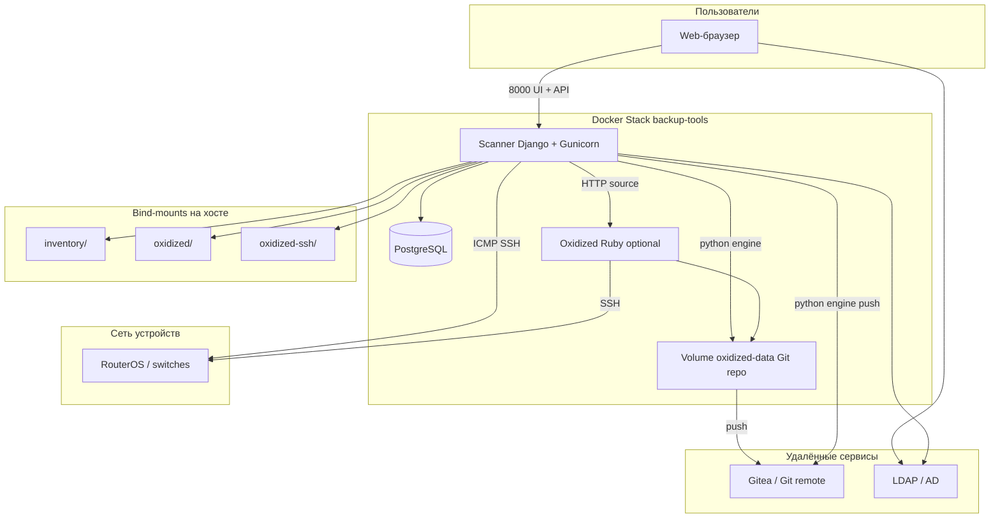

# Архитектура

## Обзор

Backup Tools объединяет три основные функции в одном стеке:

1. **Discovery и scan** — обнаружение устройств в подсетях, проверка доступности (ICMP, TCP-порты, SSH).
2. **Инвентарь** — хранение устройств, сетей и профилей учётных данных в PostgreSQL с Web UI.
3. **Бэкап конфигураций** — периодический сбор конфигов и сохранение в Git-репозиторий.



## Компоненты

### Scanner (`scanner/`)

Django-приложение с REST API и SPA на AdminLTE. Отвечает за:

- Web UI (`/ui`) и статику
- Аутентификацию (JWT в cookie + Bearer)
- CRUD инвентаря
- Запуск и мониторинг scan/discovery jobs
- HTTP source для Oxidized (`/api/oxidized/source`)
- Прокси к внешнему Oxidized (`/oxidized-proxy/*`) при `OXIDIZED_ENGINE=external`
- **Встроенный Python-движок Oxidized** (по умолчанию)

Структура кода:

```
scanner/
├── backup_tools/       # Django settings, urls, wsgi
├── api/                # HTTP views, маршруты
├── core/               # Модели БД, миграции
├── services/           # Бизнес-логика
│   ├── scanner.py      # Ping, port scan, discovery
│   ├── inventory.py    # CRUD, seed, oxidized sync
│   ├── oxidized_engine/  # Встроенный движок бэкапов
│   ├── auth.py         # JWT, пользователи
│   └── ldap_*.py       # LDAP / AD
└── static/             # UI (index.html, app.js, style.css)
```

### PostgreSQL (`db`)

Хранит:

- `devices` — устройства инвентаря
- `networks` — подсети для scan/discovery
- `credential_profiles` — SSH-логины/пароли по группам
- `users` — локальные и LDAP-пользователи
- `ldap_config` — singleton настроек LDAP (pk=1)

При первом запуске данные могут быть импортированы из `inventory/network_inventory.yml` и `inventory/inventory.yaml`.

### Oxidized — два режима (`OXIDIZED_ENGINE`)

| Режим | Контейнер oxidized | Описание |
|-------|-------------------|----------|
| `python` (default) | Не нужен | Worker в scanner, gem oxidized + Python fallback |
| `external` | Profile `external` | Ruby Oxidized, HTTP source, Web UI :8888 |

Подробнее: **[docs/engines.md](engines.md)**.

При `python`:
- Gunicorn: 1 worker
- Source: PostgreSQL → `devices_for_oxidized_source()`
- Git push: Python HookRunner (не hooks в config)

При `external`:
- Source через `/api/oxidized/source`
- Git push: hook `githubrepo` в `oxidized/config`
- UI прокси: `/oxidized-proxy/*`

### Volumes и bind-mounts

| Путь | Тип | Назначение |
|------|-----|------------|
| `pg-data` | Docker volume | Данные PostgreSQL |
| `oxidized-data` | Docker volume | Локальный Git-репозиторий с конфигами |
| `./inventory` | Bind-mount | `network_inventory.yml`, seed `inventory.yaml` |
| `./oxidized` | Bind-mount | `config`, `router.db` (legacy) |
| `./oxidized-ssh` | Bind-mount | SSH-ключи и `known_hosts` для Git push |

## Потоки данных

### Scan / Discovery

1. Оператор запускает scan через UI или `POST /scan?discover=true`.
2. Scanner читает подсети из БД (импортированные из `network_inventory.yml`).
3. Для каждого хоста: ping → проверка TCP-портов → (опционально) SSH probe для имени устройства.
4. При `discover=true` новые устройства добавляются в инвентарь.
5. Результаты доступны через `/scan/status` и `/scan/latest`.

### Бэкап конфигураций

1. **Source**: список устройств формируется из PostgreSQL (`devices_for_oxidized_source`).
2. **Collect**: SSH к устройству, выполнение model-specific команд (RouterOS: `/export`).
3. **Store**: конфиг сохраняется в Git-репозиторий на volume `oxidized-data`.
4. **Push**: hook `push_to_git` отправляет изменения в `GIT_REMOTE_URL` (HTTP с Gitea token или SSH).

### Синхронизация credentials

Пароли групп `hex` и `us` берутся из:

- переменных `.env` (`OVN_*`, `US_*`) при seed;
- профилей учётных данных в БД (UI → Настройки);
- `oxidized/config` (секция `groups`) для external-режима.

При изменении инвентаря вызывается `update_oxidized_credentials()` и (в python-режиме) `reload_config()` движка.

## Сетевая модель

- Все контейнеры в bridge-сети `backup-net`.
- Scanner должен иметь L3-доступ к подсетям устройств (ICMP, TCP на SSH-порт).
- Oxidized (external) и python-движок подключаются к устройствам по SSH из контейнера scanner.
- Git push — исходящий HTTP/SSH к Gitea.

## Безопасность

- JWT в HttpOnly cookie (`AUTH_COOKIE_NAME`) + поддержка `Authorization: Bearer`.
- RBAC: роли `viewer`, `operator`, `admin` с разграничением прав.
- Пароли в API маскируются для ролей без `credentials:read`.
- `OXIDIZED_SOURCE_TOKEN` — опциональная защита HTTP source.
- SSH-ключи монтируются read-only в scanner, read-write в oxidized (external).
