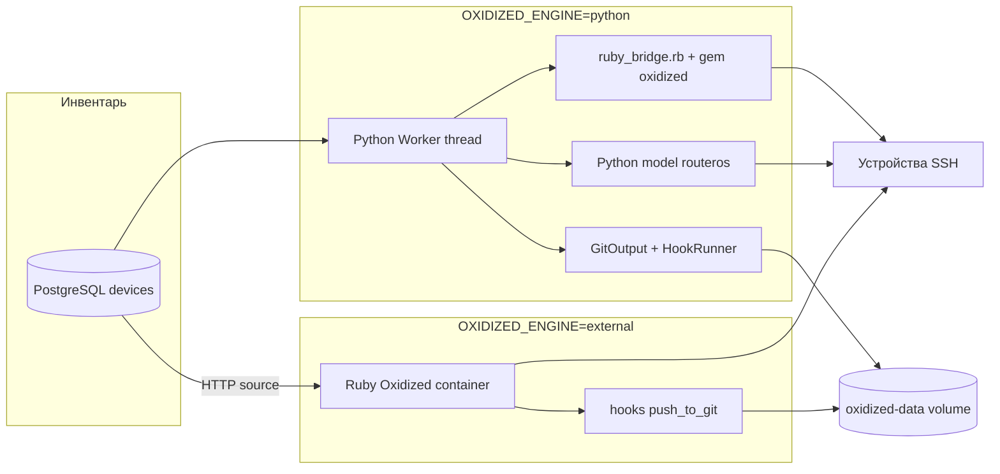

# Типы движков Oxidized

Backup Tools собирает конфигурации сетевых устройств через **Oxidized**. Выбор движка задаётся одной переменной:

```env
OXIDIZED_ENGINE=python    # по умолчанию
# или
OXIDIZED_ENGINE=external
```

Любое значение, отличное от `python`, трактуется как **Ruby Oxidized (external)**.

| | Python Oxidized | Ruby Oxidized (external) |
|---|-----------------|--------------------------|
| **Значение `OXIDIZED_ENGINE`** | `python` | `external` (или любое ≠ `python`) |
| **Отображение в UI** | Python Oxidized | Ruby Oxidized |
| **Где работает worker** | Внутри контейнера `scanner` | Отдельный контейнер `oxidized` |
| **Docker Compose** | `docker compose up -d` | `docker compose --profile external up -d` |
| **Контейнер oxidized** | Не нужен | Обязателен (`oxidized/oxidized:latest`) |
| **Gunicorn workers** | 1 (фиксировано) | 2 (или `GUNICORN_WORKERS`) |
| **Source узлов** | PostgreSQL напрямую | HTTP → `scanner:8000/api/oxidized/source` |
| **SSH к устройствам** | Из `scanner` | Из `oxidized` |
| **Модели устройств** | Gem oxidized в scanner + fallback Python | Полный upstream Oxidized |
| **Git push** | Python `HookRunner` (subprocess git) | Hook `githubrepo` в `oxidized/config` |
| **Web UI Oxidized** | Нет (только раздел Scanner UI) | `:8888` + прокси `/oxidized-proxy/*` |
| **Лог** | `OXIDIZED_PYTHON_LOG_PATH` | `OXIDIZED_LOG_PATH` / `log:` в config |
| **Sync / reload** | Перезагрузка in-process worker | Запись config + reload по mtime Ruby |



---

## Python Oxidized (`python`)

**Рекомендуется по умолчанию** — минимальный стек, один контейнер приложения, тот же UI для управления бэкапами.

### Архитектура

При старте scanner (`services/startup.py`) вызывается `start_engine()`:

1. **OxidizedManager** — singleton с конфигом из `.env` и `oxidized/config`
2. **Nodes** — загрузка узлов из PostgreSQL (`devices_for_oxidized_source`), без HTTP-запроса к самому себе
3. **Worker** — фоновый поток: очередь узлов, interval, threads, retries
4. **GitOutput** — commit в volume `oxidized-data`
5. **HookRunner** — push в `GIT_REMOTE_URL` после каждого успешного store

Gunicorn принудительно запускается с **1 worker** (`scripts/docker-entrypoint.sh`), чтобы не было нескольких параллельных worker-циклов Oxidized.

### Сбор конфигурации (модели)

Для каждого узла `Node.run()` выбирает стратегию:

```
ruby_available() ?
  ├─ да  → oxidized_bridge.rb collect  (все модели gem oxidized)
  └─ нет → Python SSHInput + registry  (сейчас: routeros)
```

В Docker-образе scanner **gem oxidized установлен** (`scanner/Dockerfile`), поэтому в production обычно активен режим **`oxidized-gem`** — поддерживаются ios, junos, aoscx и другие модели upstream Oxidized без отдельного контейнера.

Проверка в health API:

```json
GET /api/oxidized/health
{
  "engine": "python",
  "engine_title": "Python Oxidized",
  "models": "oxidized-gem",
  "nodes_count": 42,
  "log_path": "/var/lib/oxidized/oxidized-python.log"
}
```

Значение `models`:

| Значение | Описание |
|----------|----------|
| `oxidized-gem` | Ruby bridge + gem oxidized в scanner |
| `python-fallback` | Только нативные Python-модели (`routeros`) |

Список моделей gem: `GET /api/oxidized/models`.

### Git push (python)

Hooks в `oxidized/config` **не используются** — при sync scanner удаляет секцию `hooks`. Push выполняет Python-код:

- **HTTP**: `GITEA_TOKEN` + `GITEA_HTTP_USER` в URL
- **SSH**: `GIT_SSH_PRIVATE_KEY` через `GIT_SSH_COMMAND`

### Логи

| Переменная | По умолчанию |
|------------|--------------|
| `OXIDIZED_PYTHON_LOG_PATH` | `/var/lib/oxidized/oxidized-python.log` |

При записи `oxidized/config` для python-движка поле `log` принудительно ставится в `/dev/null`, чтобы Ruby-процессы не писали в общий файл. UI и `/api/oxidized/logs` читают `oxidized-python.log`.

### Sync

`POST /oxidized/sync` → `reload_engine()`: перечитывает конфиг, credentials, список узлов **без перезапуска контейнера**.

---

## Ruby Oxidized — external (`external`)

Классический [ytti/oxidized](https://github.com/ytti/oxidized) в отдельном контейнере. Имеет смысл, если нужен **нативный Web UI Oxidized**, привычные hooks Ruby или изоляция worker от scanner.

### Запуск

```env
OXIDIZED_ENGINE=external
OXIDIZED_URL=http://oxidized:8888
OXIDIZED_PORT=8888
```

```bash
docker compose --profile external up -d --build
```

Сервис `oxidized` в `docker-compose.yml` помечен `profiles: [external]` и стартует **после** healthy scanner.

### Архитектура

1. Ruby Oxidized читает `oxidized/config` (bind-mount)
2. **Source** — HTTP GET `OXIDIZED_SOURCE_URL` (список enabled-устройств из PostgreSQL)
3. **Input** — SSH к устройствам из контейнера `oxidized`
4. **Output** — git в `/var/lib/oxidized` (общий volume с python-режимом)
5. **Hooks** — `push_to_git` типа `githubrepo` в config; token подставляет `oxidized/entrypoint.sh`

Scanner **не** запускает python worker. API (`/api/oxidized/nodes`, fetch, versions) **проксирует** запросы на `OXIDIZED_URL`.

Раздел UI **Oxidized Web** — iframe через `/oxidized-proxy/nodes`.

### Git push (external)

Секция `hooks` записывается в `oxidized/config` при sync:

```yaml
hooks:
  push_to_git:
    type: githubrepo
    events: [post_store]
    remote_repo: http://gitea/...
    username: oauth2
    password: <GITEA_TOKEN>
    # или privatekey/publickey для SSH
```

Entrypoint контейнера oxidized подставляет `GITEA_TOKEN` в config при старте.

### Логи

| Переменная / config | По умолчанию |
|---------------------|--------------|
| `OXIDIZED_LOG_PATH` | `/var/lib/oxidized/oxidized.log` |
| `log:` в `oxidized/config` | То же (используется Ruby) |

### Sync

`POST /oxidized/sync`:

1. Обновляет `oxidized/config` (groups, source, hooks)
2. Проверяет доступность `http://oxidized:8888/nodes.json`
3. Ruby Oxidized подхватывает изменения config по **mtime** (перезапуск контейнера не обязателен)

Если контейнер `oxidized` не запущен, config всё равно записывается на диск, но сбор конфигов не идёт.

---

## Общее для обоих движков

### Source данных

Оба движка берут узлы из **одного инвентаря PostgreSQL** — enabled-устройства с полями name, ip, model, group, ports.

Публичный эндпоинт (для external):

```http
GET /api/oxidized/source
X-Auth-Token: <OXIDIZED_SOURCE_TOKEN>   # опционально
```

Python-движок вызывает ту же функцию `devices_for_oxidized_source()` напрямую, без HTTP.

### Общий Git-репозиторий

Volume `oxidized-data` → `/var/lib/oxidized`. При переключении движка история конфигов сохраняется.

### Credentials

Группы `hex`, `us`, … синхронизируются из профилей инвентаря в `oxidized/config` → секция `groups`. Источник паролей: `.env` (`OVN_*`, `US_*`) при seed, далее UI → Настройки.

### oxidized/config — различия при sync

| Секция | python | external |
|--------|--------|----------|
| `log` | `/dev/null` | `OXIDIZED_LOG_PATH` |
| `rest` | удаляется | `0.0.0.0:8888` |
| `hooks` | удаляется | `push_to_git` если `GIT_REMOTE_URL` |
| `source.http` | да (для bridge/config) | да (рабочий source) |

---

## Как выбрать движок

| Сценарий | Рекомендация |
|----------|--------------|
| Стандартный деплой, RouterOS + несколько других вендоров | **python** |
| Минимум контейнеров, один порт 8000 | **python** |
| Нужен классический Web UI Oxidized на :8888 | **external** |
| Кастомные Ruby-модели / hooks Oxidized | **external** |
| Изоляция SSH worker от scanner | **external** |
| Только MikroTik, gem oxidized недоступен | **python** (fallback `routeros`) |

---

## Переключение движка

### python → external

```env
OXIDIZED_ENGINE=external
```

```bash
docker compose --profile external up -d
curl -X POST http://localhost:8000/oxidized/sync -b cookies.txt
```

### external → python

```env
OXIDIZED_ENGINE=python
```

```bash
docker compose stop oxidized
docker compose up -d scanner
curl -X POST http://localhost:8000/oxidized/sync -b cookies.txt
```

Проверка:

```bash
curl -s http://localhost:8000/api/oxidized/health | jq '{engine, engine_title, models, nodes_count}'
```

---

## Связанные документы

- [Oxidized и бэкапы](oxidized.md) — Git push, SSH-ключи, API, troubleshooting
- [Конfigурация](configuration.md) — переменные `.env`
- [Архитектура](architecture.md) — общая схема стека
