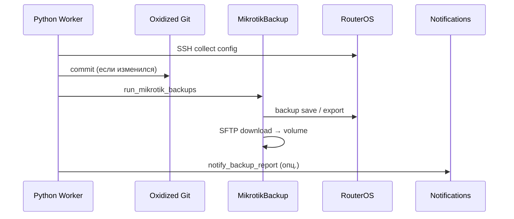

# MikroTik binary/export бэкапы

Помимо Git-конфигов Oxidized, Backup Tools поддерживает **файловые бэкапы MikroTik** (порт [RealMikrotikBackup](https://github.com/search?q=RealMikrotikBackup)):

- **Binary** — `/system backup save` → `.backup` файлы с датой
- **Export** — `/export` → `.rsc` скрипт конфигурации

Функция работает **только при `OXIDIZED_ENGINE=python`** — выполняется в worker после каждого цикла сбора конфига для узлов с моделью `routeros`.

## Поток выполнения



1. Worker собирает конфиг Oxidized (Git)
2. Для `routeros` вызывается `MikrotikBackup.run_for_node()`
3. Binary и/или export скачиваются по SFTP в volume
4. При успехе/ошибке — опциональные уведомления Telegram/Email

## Хранение файлов

| Тип | Каталог (volume) | Именование |
|-----|------------------|------------|
| Binary | `MK_BACKUP_BIN_DIR` → `/var/lib/oxidized/bin` | `{id}_{name}_{YYYY-MM-DD_HH-MM-SS}.backup`, `{id}_{name}_last.backup` |
| Export | `MK_BACKUP_RSC_DIR` → `/var/lib/oxidized/rsc` | `{id}_{name}.rsc` |

Префикс `{id}_` — ID устройства из PostgreSQL (для уникальности при переименовании).

### Ротация binary

При `purge_enabled=true` хранится последние `purge_keep` dated-файлов (по умолчанию 10). Файл `_last.backup` не удаляется ротацией.

## Настройка

### Переменные `.env`

```env
MK_BACKUP_BINARY=true
MK_BACKUP_EXPORT=true
MK_BACKUP_HIDE_SENSITIVE=false
# MK_BACKUP_ENCRYPT_PASSWORD=secret-for-aes-backup
MK_BACKUP_BIN_DIR=/var/lib/oxidized/bin
MK_BACKUP_RSC_DIR=/var/lib/oxidized/rsc
MK_BACKUP_TIMEOUT=300
PURGE_OLD_BACKUP=true
PURGE_N_PIECE=10
```

| Переменная | По умолчанию | Описание |
|------------|--------------|----------|
| `MK_BACKUP_BINARY` | `true` | Создавать binary `.backup` |
| `MK_BACKUP_EXPORT` | `true` | Создавать export `.rsc` |
| `MK_BACKUP_HIDE_SENSITIVE` | `false` | Скрывать секреты в export (RoS6: `hide-sensitive`) |
| `MK_BACKUP_ENCRYPT_PASSWORD` | — | AES-SHA256 шифрование binary (если задан) |
| `MK_BACKUP_BIN_DIR` | `/var/lib/oxidized/bin` | Каталог binary |
| `MK_BACKUP_RSC_DIR` | `/var/lib/oxidized/rsc` | Каталог export |
| `MK_BACKUP_TIMEOUT` | `300` | Таймаут SSH/SFTP (сек) |
| `MK_BACKUP_GIT_PUSH` | `true`* | Коммит и push `bin/` + `rsc/` в `GIT_REMOTE_URL` |

\* По умолчанию включено, если задан `GIT_REMOTE_URL`.
| `PURGE_OLD_BACKUP` | `true` | Ротация старых binary |
| `PURGE_N_PIECE` | `10` | Сколько dated binary хранить |

### Web UI

**Настройки → Бэкап → MikroTik binary/export**

Настройки хранятся в PostgreSQL (`backup_config`, pk=1). При первом запуске импортируются из `.env`.

API: `GET/PUT /api/settings/backup`

## Export: RoS6 vs RoS7

Команда export выбирается автоматически по major-версии RouterOS:

| Версия | hide_sensitive=false | hide_sensitive=true |
|--------|---------------------|---------------------|
| RoS6 | `/export file=...` | `/export hide-sensitive file=...` |
| RoS7 | `[:parse "/export show-sensitive file=..."]` | `/export file=...` |

Переопределение на устройство: vars `remove_secret=true/false` в source (редко используется).

## Web UI и API

### Список файлов узла

```http
GET /api/oxidized/nodes/{name}/backups
```

```json
{
  "name": "hex_r1_ukg",
  "backups": {
    "binary": [{"name": "42_hex_r1_ukg_2026-06-17_12-00-00.backup", "size": 12345, "mtime": 1710000000}],
    "export": [{"name": "42_hex_r1_ukg.rsc", "size": 5678, "mtime": 1710000000}]
  }
}
```

### Скачивание

```http
GET /api/oxidized/nodes/{name}/backups/download?type=bin&file=42_hex_r1_ukg_last.backup
GET /api/oxidized/nodes/{name}/backups/download?type=rsc&file=42_hex_r1_ukg.rsc
```

### Backup all (очередь fetch)

```http
POST /api/oxidized/backup/all
```

Ставит все узлы в начало очереди worker (python only). Ответ: `{"status":"ok","queued":42}`.

## Уведомления

См. [notifications.md](notifications.md).

- **Ошибка** MikroTik backup → `notify_backup_error`
- **Отчёт** после цикла (если конфиг изменился или binary failed) → `notify_backup_report`

## Ограничения

| Ограничение | Описание |
|-------------|----------|
| Только python engine | Worker в scanner; external Ruby не запускает MikrotikBackup |
| Только routeros | Другие модели пропускаются |
| Volume | `bin/` и `rsc/` на `oxidized-data`; при `MK_BACKUP_GIT_PUSH` — в том же Git remote |
| Права SFTP | Учётная запись SSH должна иметь доступ к `/file` на роутере |

## Troubleshooting

| Симптом | Решение |
|---------|---------|
| Нет файлов в UI | Проверить `MK_BACKUP_*` enabled, модель `routeros`, python engine |
| SFTP timeout | Увеличить `MK_BACKUP_TIMEOUT` |
| Binary fail encrypt | Задать `MK_BACKUP_ENCRYPT_PASSWORD` или `dont-encrypt=yes` |
| Диск заполнен | Включить purge, уменьшить `PURGE_N_PIECE` |

```bash
docker compose exec scanner ls -la /var/lib/oxidized/bin/
docker compose exec scanner ls -la /var/lib/oxidized/rsc/
docker compose exec scanner tail -50 /var/lib/oxidized/oxidized-python.log | grep mikrotik
```
